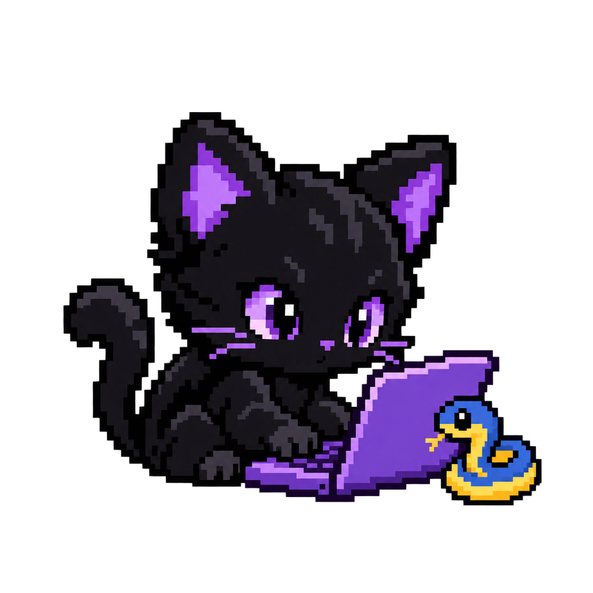

<h1>Oi, me chamo Laís.</h1>

<h2>&nbsp;&nbsp;&nbsp;&nbsp;&nbsp;&nbsp;&nbsp;&nbsp;&nbsp;&nbsp;&nbsp;&nbsp;&nbsp;Sobre mim</h2>

No mundo virtual, meus amigos me chamam de Estivus ou Estivinhas. Sou professora de Língua Inglesa, apaixonada por tecnologia e tenho um hiperfoco em gatos e formigas.

A linguagem com que tenho mais afinidade é Python. Aprendi pelo Start by Alura para ensinar programação no itinerário de Exatas do Novo Ensino Médio Paulista.

 

---

<h2 align="right">Projetos em desenvolvimento</h2>

- **[EM BREVE]** — Descrição do projeto. [Ver código](link)
- **[EM BREVE]** — Descrição do projeto. [Ver código](link)

 

---

<h2>&nbsp;&nbsp;&nbsp;&nbsp;&nbsp;&nbsp;&nbsp;&nbsp;&nbsp;&nbsp;&nbsp;&nbsp;&nbsp;&nbsp;&nbsp;&nbsp;&nbsp;Contato</h2>

  

[LinkedIn](https://www.linkedin.com/in/laisqueiroz/) · [E-mail](mailto:contato@codesbyerax.com)

 
